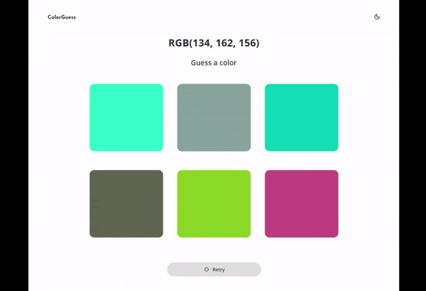

<h1>Color Guess</h1>

A simple game where the main goal of the six proposed color options is to guess the correct one according to the given RGB numbers.

<h2>Description</h2>

It's a study project where the main goal was to improve skills in JS and responsive layout.

<h2>Features</h2>

1. Fully responsive layout

2. Import it in Android Studio
3. Sync Gradle and run on your device/emulator